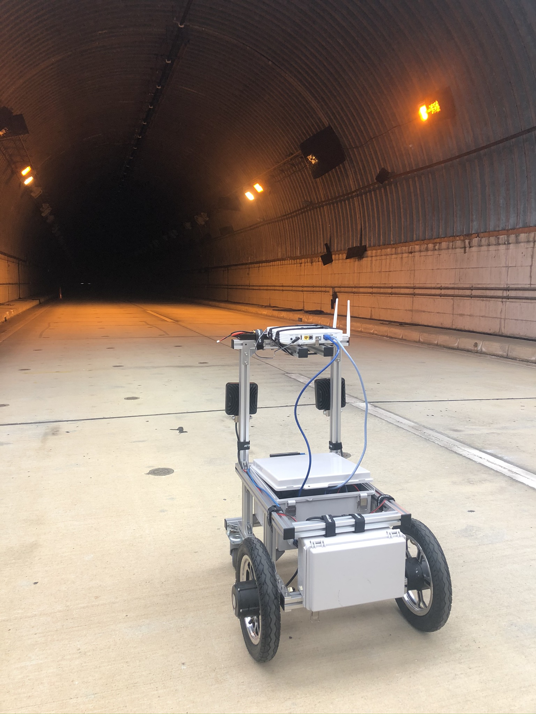
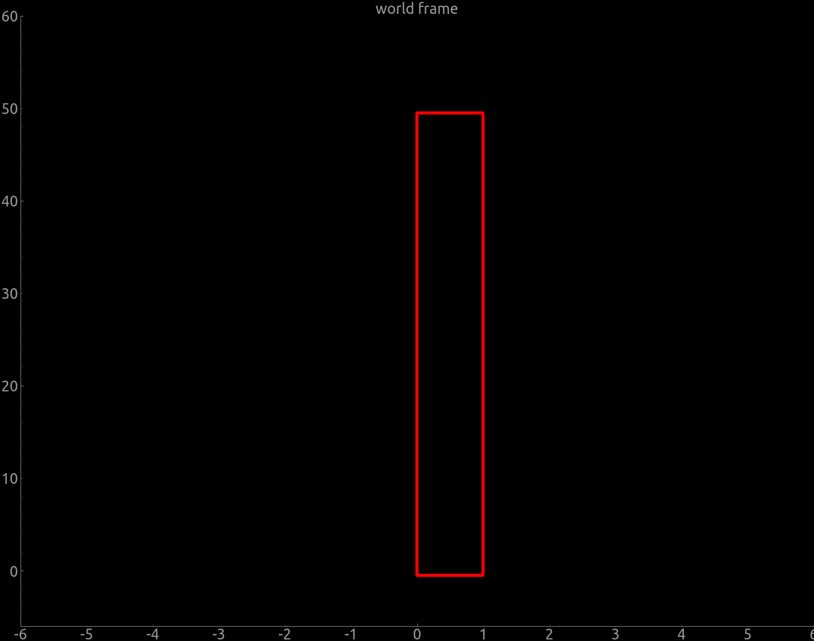

# ATCart-simple-path
This is a simple path tracking of ATCart by using Intel Realsense T265 tracking module.

ATCart is using MOAB controller board for low-level I/O and motor control, please follow this [repo](https://github.com/rasheeddo/atdrive-moab/tree/master) for more detail.

## Requirements
1. You need to have [librealsense SDK](https://github.com/IntelRealSense/librealsense) installed on your autopilot pc. 
2. You need to have pyqtgraph installed on your base station PC to visualize about the desired path and UGV's motion.

## Before Run
If you think everything is set up properly you can firstly try `testOdometry.py` to see the odometer printing out to the screen. Please keep in mind that this is just simple path planning to test the T265 tracker module so the path that I made here are just square shape and rectangle shape. So the robot will go along this path forever. We will be running the script `goSquare.py` or `goRectangle.py` on the autopilot PC. On our base station PC, we need to run a script `recvQtPlotSquare.py` or `recvQtPlotRect.py` according to which autopilot script you want to run on the robot side. Please change the `GUI_IP` on line 33 of a python script to match your base station PC.

## Run
You can run `recvQtyPlot__.py` on your base station PC first, then it will pop up the window as this one.

After that you need to run the autopilot script on the robot PC by ssh from your PC. If you are using Futaba transmitter, we need to switch ch5. to auto mode (blue LED on the MOAB board). This [video](https://www.youtube.com/watch?v=WnMXmoMtPBk&t=1s) is the result if everything is running without problem. In this case, I was running `goSquare.py` on the robot side, and `recvQtPlotSquare.py` on my laptop. You can try adjust the distance by changing `dist = 3.0` variable on line70 of `goSquare.py`, but please keep in mind that on your visualization screen you need to change that variable also on line26 of `goSquare.py`, this should be same value. Similar with `goRectangle.py` and `recvQtPlotRect.py`, you can adjust the short and long distance on line70 and 71 of `goSquare.py` and line26 and 27 on `recvQtPlotRect.py`. 

You can see how the robot running on [this link](https://www.youtube.com/watch?v=WnMXmoMtPBk&t=1s)

